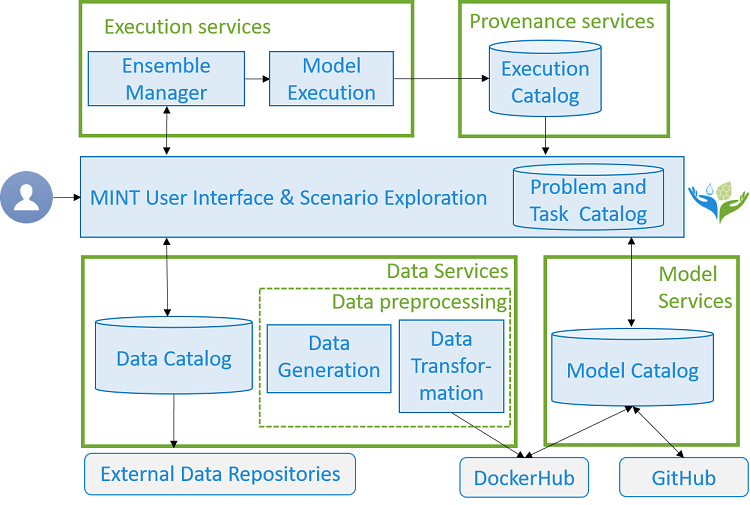

# MINT
This repository provides an entry point to the services and tools included in the MINT framework, including a pointer to their latest release or DOI. This page can also be browsed at https://mintproject.github.io/mint:

### Data services:
- MINT Data Catalog User Interface and API: 
- Dataset Representation Language for Reading Heterogeneous Datasets (D-REPR): https://github.com/usc-isi-i2/d-repr/releases/tag/2.9.3
- MINT Data transformation service 
- Canonicalization Compound Unit Representation & Transformation (CCUT): https://github.com/basels/ccut
- Remote Sensing Services for Ethiopia [(DEMO)](http://umnlcc.cs.umn.edu/river-width-demo/)

### Model Services:
- MINT Model Catalog: 
- Model Catalog API: https://github.com/mintproject/model-catalog-api/releases/tag/1.6.0
- Model Insertion Checker (MIC): https://github.com/mintproject/mic/releases/tag/1.3.7
- Desktop Application for Model Execution (DAME): https://github.com/mintproject/dame_cli/releases/tag/5.4.5

### MINT User Interface:
- MINT User interface: 

### Execution Services:
- Ensemble manager : https://github.com/mintproject/mint-ensemble-manager/releases/tag/1.0.0
- Result ingestion API: https://github.com/mintproject/ingestion-api/releases/tag/1.1.0

### Other:
- Scientific Variables Ontology (SVO): https://github.com/mariutzica/ScientificVariablesOntology
